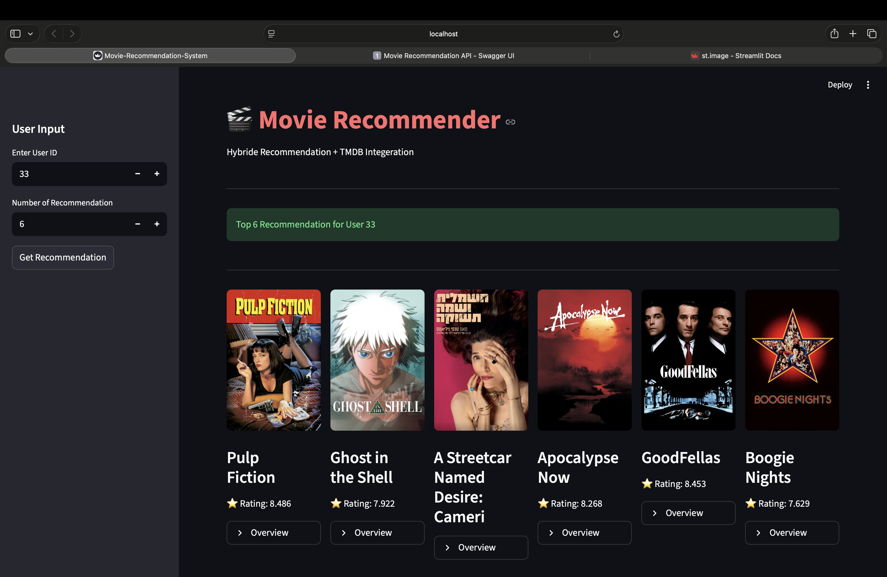

# Hybrid Movie Recommendation System (FastAPI + SVD + TF-IDF)


---

##  Sample UI

<p align="center">
  
</p>

---

It is a **production-ready hybrid movie recommendation API** that combines:

-  Collaborative Filtering (SVD)
-  Content-Based Filtering (TF-IDF + Cosine Similarity)
-  TMDB API Integration (posters, overview, ratings)

It delivers **personalized, ranked movie recommendations** via a FastAPI backend.

---

#  Live Capabilities

- Personalized recommendations per user
- Filters already-rated movies
- Handles unknown users gracefully
- TMDB metadata enrichment
- Modular ML architecture
- Swagger auto documentation

---

#  System Architecture

```
                +----------------------+
                |      User API        |
                |  /recommend/{id}     |
                +----------+-----------+
                           |
                           v
                +----------------------+
                |     Hybrid Engine    |
                |----------------------|
                | 1. Collaborative     |
                |    (SVD Model)       |
                | 2. Content-Based     |
                |    (TF-IDF + Cosine) |
                +----------+-----------+
                           |
                           v
                +----------------------+
                |   TMDB API Client    |
                |  (Poster, Overview)  |
                +----------+-----------+
                           |
                           v
                +----------------------+
                |   JSON API Response  |
                +----------------------+
```

---

#  Recommendation Strategy

## 1 Collaborative Filtering (SVD)

- Learns latent features from user–movie rating matrix
- Predicts ratings for unseen movies
- Personalized ranking per user

Library used:
- `scikit-surprise`

---

## 2 Content-Based Filtering

- Uses movie genres
- TF-IDF vectorization
- Cosine similarity to find similar movies

Library used:
- `scikit-learn`

---

## 4 Hybrid Logic

- Prioritizes collaborative predictions
- Falls back to content-based similarity when needed
- Removes already-rated movies
- Returns top-N ranked movies

---

#  Project Structure

```
filmfusion/
│
├── api/
│   └── main.py                # FastAPI entrypoint
│
├── src/
│   ├── collaborative.py       # SVD model logic
│   ├── content_based.py       # TF-IDF similarity
│   ├── hybrid.py              # Hybrid recommender
│   ├── tmdb_client.py         # TMDB integration
│
├── models/
│   ├── svd_model.pkl
│   ├── tfidf_vectorizer.pkl
│   ├── tfidf_matrix.pkl
│
├── data/
│   ├── movies.csv
│   ├── ratings.csv
│
├── requirements.txt
├── .env
└── README.md
```

---

#  API Documentation

After running the server:

```
http://127.0.0.1:8000/docs
```

Swagger UI auto-generates interactive documentation.

---

#  API Endpoints

## Health Check

```
GET /health
```

Response:
```json
{
  "status": "ok"
}
```

---

## Get Recommendations

```
GET /recommend/user/{user_id}?top_n=10
```

Example:
```
GET /recommend/user/4?top_n=5
```

Response:
```json
{
  "user_id": 4,
  "recommendations": [
    {
      "title": "Toy Story",
      "overview": "A story of toys that come to life...",
      "rating": 8.3,
      "poster_url": "https://image.tmdb.org/..."
    }
  ]
}
```

---

#  Environment Variables

Create a `.env` file:

```
TMDB_API_KEY=your_tmdb_api_key_here
```

---

#  Installation Guide

## 1 Clone Repository

```
git clone https://github.com/your-username/filmfusion.git
cd filmfusion
```

## 2 Create Virtual Environment

```
conda create -n filmfusion python=3.10
conda activate filmfusion
```

## 3 Install Dependencies

```
pip install -r requirements.txt
```

## 4 Run Server

```
uvicorn api.main:app --reload
```

---

#  Dataset

This project uses a MovieLens-style dataset:

- `movies.csv`
- `ratings.csv`

Format:
```
userId, movieId, rating
```

---

#  Tech Stack
-----------------------------------------
| Layer         | Technology            |
|---------------|-----------------------|
| Backend       | FastAPI               |
| ML Model      | Surprise (SVD)        |
| NLP           | TF-IDF (scikit-learn) |
| Data          | Pandas, NumPy         |
| External API  | TMDB                  |
| Serialization | Pydantic              |

---

#  Performance Considerations

- Pretrained SVD model loaded from disk
- TF-IDF matrix precomputed
- Minimal API latency
- Ready for containerization

---

#  Docker (Optional Future)

```
FROM python:3.10

WORKDIR /app
COPY . .

RUN pip install -r requirements.txt

CMD ["uvicorn", "api.main:app", "--host", "0.0.0.0", "--port", "8000"]
```

---

#  Future Improvements

- JWT Authentication
- Weighted hybrid scoring
- Real-time model retraining
- Redis caching
- Frontend UI
- CI/CD pipeline
- Cloud deployment (AWS / Render)
  
---

# Author

**Nandhu Gopan** 
---

⭐ If you found this useful, give it a star!
